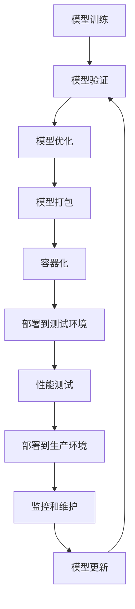

# 机器学习模型部署实践指南

机器学习模型部署是将训练好的模型投入生产环境为实际业务服务的关键步骤。本文将详细介绍从模型准备到生产部署的完整流程。

## 模型部署概述

### 部署流程



### 部署方式对比

| 部署方式 | 优点 | 缺点 | 适用场景 |
|---------|------|------|----------|
| 批处理 | 简单、资源利用率高 | 延迟高、不适合实时 | 离线分析、报表生成 |
| 实时API | 延迟低、交互性强 | 资源消耗大、复杂度高 | 推荐系统、实时预测 |
| 流处理 | 处理连续数据流 | 复杂度高、状态管理困难 | 实时监控、异常检测 |
| 边缘部署 | 延迟极低、隐私保护 | 资源受限、维护困难 | IoT设备、移动应用 |

## 模型准备和优化

### 1. 模型序列化

```python
import joblib
import pickle
import torch
import tensorflow as tf
from sklearn.ensemble import RandomForestClassifier
import onnx
import onnxruntime

# Scikit-learn模型保存
def save_sklearn_model(model, filepath):
    """保存sklearn模型"""
    joblib.dump(model, filepath)
    print(f"Model saved to {filepath}")

def load_sklearn_model(filepath):
    """加载sklearn模型"""
    return joblib.load(filepath)

# PyTorch模型保存
def save_pytorch_model(model, filepath):
    """保存PyTorch模型"""
    # 保存完整模型
    torch.save(model, filepath)
    
    # 或者只保存状态字典（推荐）
    torch.save(model.state_dict(), filepath.replace('.pth', '_state.pth'))

def load_pytorch_model(model_class, filepath, state_dict_path=None):
    """加载PyTorch模型"""
    if state_dict_path:
        model = model_class()
        model.load_state_dict(torch.load(state_dict_path))
        model.eval()
        return model
    else:
        return torch.load(filepath)

# TensorFlow模型保存
def save_tensorflow_model(model, filepath):
    """保存TensorFlow模型"""
    # SavedModel格式（推荐）
    tf.saved_model.save(model, filepath)
    
    # 或者HDF5格式
    model.save(filepath + '.h5')

def load_tensorflow_model(filepath):
    """加载TensorFlow模型"""
    return tf.saved_model.load(filepath)

# ONNX格式转换（跨平台）
def convert_to_onnx(pytorch_model, dummy_input, onnx_path):
    """将PyTorch模型转换为ONNX格式"""
    torch.onnx.export(
        pytorch_model,
        dummy_input,
        onnx_path,
        export_params=True,
        opset_version=11,
        do_constant_folding=True,
        input_names=['input'],
        output_names=['output'],
        dynamic_axes={
            'input': {0: 'batch_size'},
            'output': {0: 'batch_size'}
        }
    )
    print(f"ONNX model saved to {onnx_path}")

def load_onnx_model(onnx_path):
    """加载ONNX模型"""
    return onnxruntime.InferenceSession(onnx_path)
```

### 2. 模型优化

```python
import torch
import torch.nn as nn
import torch.quantization as quantization
from torch.jit import script
import tensorflow as tf

# PyTorch模型优化
class ModelOptimizer:
    def __init__(self, model):
        self.model = model
    
    def quantize_dynamic(self):
        """动态量化"""
        quantized_model = torch.quantization.quantize_dynamic(
            self.model,
            {nn.Linear, nn.Conv2d},
            dtype=torch.qint8
        )
        return quantized_model
    
    def quantize_static(self, calibration_loader):
        """静态量化"""
        self.model.eval()
        self.model.qconfig = torch.quantization.get_default_qconfig('fbgemm')
        
        # 准备量化
        prepared_model = torch.quantization.prepare(self.model)
        
        # 校准
        with torch.no_grad():
            for data, _ in calibration_loader:
                prepared_model(data)
        
        # 转换为量化模型
        quantized_model = torch.quantization.convert(prepared_model)
        return quantized_model
    
    def trace_model(self, example_input):
        """模型追踪优化"""
        self.model.eval()
        traced_model = torch.jit.trace(self.model, example_input)
        return traced_model
    
    def script_model(self):
        """脚本化模型"""
        scripted_model = torch.jit.script(self.model)
        return scripted_model

# TensorFlow模型优化
def optimize_tensorflow_model(model, representative_dataset=None):
    """TensorFlow模型优化"""
    converter = tf.lite.TFLiteConverter.from_saved_model(model)
    
    # 启用优化
    converter.optimizations = [tf.lite.Optimize.DEFAULT]
    
    # 量化
    if representative_dataset:
        converter.representative_dataset = representative_dataset
        converter.target_spec.supported_ops = [tf.lite.OpsSet.TFLITE_BUILTINS_INT8]
        converter.inference_input_type = tf.int8
        converter.inference_output_type = tf.int8
    
    tflite_model = converter.convert()
    return tflite_model

# 模型压缩
def prune_model(model, amount=0.3):
    """模型剪枝"""
    import torch.nn.utils.prune as prune
    
    for name, module in model.named_modules():
        if isinstance(module, (nn.Conv2d, nn.Linear)):
            prune.l1_unstructured(module, name='weight', amount=amount)
            prune.remove(module, 'weight')
    
    return model

# 性能基准测试
def benchmark_model(model, input_shape, num_runs=100):
    """模型性能基准测试"""
    import time
    import numpy as np
    
    model.eval()
    dummy_input = torch.randn(input_shape)
    
    # 预热
    for _ in range(10):
        with torch.no_grad():
            _ = model(dummy_input)
    
    # 基准测试
    times = []
    with torch.no_grad():
        for _ in range(num_runs):
            start_time = time.time()
            _ = model(dummy_input)
            end_time = time.time()
            times.append(end_time - start_time)
    
    avg_time = np.mean(times)
    std_time = np.std(times)
    
    print(f"Average inference time: {avg_time*1000:.2f}ms ± {std_time*1000:.2f}ms")
    print(f"Throughput: {1/avg_time:.2f} inferences/second")
    
    return avg_time, std_time
```

## 模型服务化

### 1. Flask API服务

```python
from flask import Flask, request, jsonify
import numpy as np
import joblib
import logging
from functools import wraps
import time
from prometheus_client import Counter, Histogram, generate_latest

# 监控指标
REQUEST_COUNT = Counter('ml_requests_total', 'Total ML requests', ['method', 'endpoint'])
REQUEST_LATENCY = Histogram('ml_request_duration_seconds', 'ML request latency')
PREDICTION_COUNT = Counter('ml_predictions_total', 'Total predictions made')

app = Flask(__name__)

# 配置日志
logging.basicConfig(level=logging.INFO)
logger = logging.getLogger(__name__)

class ModelService:
    def __init__(self, model_path):
        self.model = None
        self.model_path = model_path
        self.load_model()
    
    def load_model(self):
        """加载模型"""
        try:
            self.model = joblib.load(self.model_path)
            logger.info(f"Model loaded from {self.model_path}")
        except Exception as e:
            logger.error(f"Failed to load model: {e}")
            raise
    
    def preprocess(self, data):
        """数据预处理"""
        try:
            # 转换为numpy数组
            if isinstance(data, list):
                data = np.array(data)
            
            # 数据验证
            if data.ndim == 1:
                data = data.reshape(1, -1)
            
            # 特征缩放等预处理
            # data = self.scaler.transform(data)
            
            return data
        except Exception as e:
            logger.error(f"Preprocessing failed: {e}")
            raise ValueError(f"Invalid input data: {e}")
    
    def predict(self, data):
        """模型预测"""
        try:
            processed_data = self.preprocess(data)
            predictions = self.model.predict(processed_data)
            probabilities = None
            
            # 如果模型支持概率预测
            if hasattr(self.model, 'predict_proba'):
                probabilities = self.model.predict_proba(processed_data)
            
            return {
                'predictions': predictions.tolist(),
                'probabilities': probabilities.tolist() if probabilities is not None else None
            }
        except Exception as e:
            logger.error(f"Prediction failed: {e}")
            raise
    
    def get_model_info(self):
        """获取模型信息"""
        return {
            'model_type': type(self.model).__name__,
            'model_path': self.model_path,
            'features': getattr(self.model, 'n_features_in_', 'unknown')
        }

# 初始化模型服务
model_service = ModelService('model.joblib')

# 装饰器：监控请求
def monitor_requests(f):
    @wraps(f)
    def decorated_function(*args, **kwargs):
        start_time = time.time()
        REQUEST_COUNT.labels(method=request.method, endpoint=request.endpoint).inc()
        
        try:
            result = f(*args, **kwargs)
            return result
        finally:
            REQUEST_LATENCY.observe(time.time() - start_time)
    
    return decorated_function

@app.route('/health', methods=['GET'])
def health_check():
    """健康检查"""
    return jsonify({
        'status': 'healthy',
        'timestamp': time.time(),
        'model_loaded': model_service.model is not None
    })

@app.route('/info', methods=['GET'])
def model_info():
    """模型信息"""
    return jsonify(model_service.get_model_info())

@app.route('/predict', methods=['POST'])
@monitor_requests
def predict():
    """预测接口"""
    try:
        data = request.get_json()
        
        if not data or 'features' not in data:
            return jsonify({'error': 'Missing features in request'}), 400
        
        result = model_service.predict(data['features'])
        PREDICTION_COUNT.inc()
        
        return jsonify({
            'success': True,
            'result': result,
            'timestamp': time.time()
        })
    
    except ValueError as e:
        return jsonify({'error': str(e)}), 400
    except Exception as e:
        logger.error(f"Prediction error: {e}")
        return jsonify({'error': 'Internal server error'}), 500

@app.route('/batch_predict', methods=['POST'])
@monitor_requests
def batch_predict():
    """批量预测接口"""
    try:
        data = request.get_json()
        
        if not data or 'batch_features' not in data:
            return jsonify({'error': 'Missing batch_features in request'}), 400
        
        results = []
        for features in data['batch_features']:
            result = model_service.predict(features)
            results.append(result)
        
        PREDICTION_COUNT.inc(len(results))
        
        return jsonify({
            'success': True,
            'results': results,
            'count': len(results),
            'timestamp': time.time()
        })
    
    except Exception as e:
        logger.error(f"Batch prediction error: {e}")
        return jsonify({'error': 'Internal server error'}), 500

@app.route('/metrics', methods=['GET'])
def metrics():
    """Prometheus监控指标"""
    return generate_latest()

@app.errorhandler(404)
def not_found(error):
    return jsonify({'error': 'Endpoint not found'}), 404

@app.errorhandler(500)
def internal_error(error):
    return jsonify({'error': 'Internal server error'}), 500

if __name__ == '__main__':
    app.run(host='0.0.0.0', port=5000, debug=False)
```

### 2. FastAPI高性能服务

```python
from fastapi import FastAPI, HTTPException, BackgroundTasks
from pydantic import BaseModel, validator
from typing import List, Optional
import asyncio
import aioredis
import uvicorn
import numpy as np
from datetime import datetime
import json

# 数据模型
class PredictionRequest(BaseModel):
    features: List[float]
    model_version: Optional[str] = "latest"
    
    @validator('features')
    def validate_features(cls, v):
        if len(v) == 0:
            raise ValueError('Features cannot be empty')
        return v

class BatchPredictionRequest(BaseModel):
    batch_features: List[List[float]]
    model_version: Optional[str] = "latest"

class PredictionResponse(BaseModel):
    prediction: List[float]
    probability: Optional[List[float]] = None
    model_version: str
    timestamp: datetime
    request_id: str

class BatchPredictionResponse(BaseModel):
    predictions: List[PredictionResponse]
    total_count: int
    processing_time: float

# FastAPI应用
app = FastAPI(
    title="ML Model API",
    description="High-performance machine learning model serving API",
    version="1.0.0"
)

class AsyncModelService:
    def __init__(self):
        self.model = None
        self.redis = None
        self.model_cache = {}
    
    async def startup(self):
        """启动时初始化"""
        # 连接Redis
        self.redis = await aioredis.from_url("redis://localhost")
        
        # 加载模型
        await self.load_model()
    
    async def shutdown(self):
        """关闭时清理"""
        if self.redis:
            await self.redis.close()
    
    async def load_model(self, version="latest"):
        """异步加载模型"""
        if version not in self.model_cache:
            # 模拟异步模型加载
            await asyncio.sleep(0.1)
            # 实际应用中这里会从存储加载模型
            self.model_cache[version] = "mock_model"
        
        self.model = self.model_cache[version]
    
    async def predict_async(self, features: List[float], model_version: str = "latest") -> dict:
        """异步预测"""
        # 确保使用正确版本的模型
        if model_version not in self.model_cache:
            await self.load_model(model_version)
        
        # 模拟异步预测
        await asyncio.sleep(0.01)
        
        # 实际预测逻辑
        prediction = [np.random.random() for _ in range(3)]
        probability = [np.random.random() for _ in range(3)]
        
        return {
            'prediction': prediction,
            'probability': probability
        }
    
    async def cache_result(self, request_id: str, result: dict, ttl: int = 3600):
        """缓存预测结果"""
        if self.redis:
            await self.redis.setex(
                f"prediction:{request_id}",
                ttl,
                json.dumps(result, default=str)
            )
    
    async def get_cached_result(self, request_id: str) -> Optional[dict]:
        """获取缓存的预测结果"""
        if self.redis:
            cached = await self.redis.get(f"prediction:{request_id}")
            if cached:
                return json.loads(cached)
        return None

# 全局模型服务实例
model_service = AsyncModelService()

@app.on_event("startup")
async def startup_event():
    await model_service.startup()

@app.on_event("shutdown")
async def shutdown_event():
    await model_service.shutdown()

@app.get("/health")
async def health_check():
    return {
        "status": "healthy",
        "timestamp": datetime.now(),
        "model_loaded": model_service.model is not None
    }

@app.post("/predict", response_model=PredictionResponse)
async def predict(
    request: PredictionRequest,
    background_tasks: BackgroundTasks
):
    """单个预测"""
    try:
        import uuid
        request_id = str(uuid.uuid4())
        
        # 检查缓存
        cached_result = await model_service.get_cached_result(request_id)
        if cached_result:
            return PredictionResponse(**cached_result)
        
        # 执行预测
        result = await model_service.predict_async(
            request.features,
            request.model_version
        )
        
        response = PredictionResponse(
            prediction=result['prediction'],
            probability=result['probability'],
            model_version=request.model_version,
            timestamp=datetime.now(),
            request_id=request_id
        )
        
        # 后台任务：缓存结果
        background_tasks.add_task(
            model_service.cache_result,
            request_id,
            response.dict()
        )
        
        return response
    
    except Exception as e:
        raise HTTPException(status_code=500, detail=str(e))

@app.post("/batch_predict", response_model=BatchPredictionResponse)
async def batch_predict(request: BatchPredictionRequest):
    """批量预测"""
    try:
        start_time = asyncio.get_event_loop().time()
        
        # 并发执行预测
        tasks = [
            model_service.predict_async(features, request.model_version)
            for features in request.batch_features
        ]
        
        results = await asyncio.gather(*tasks)
        
        predictions = [
            PredictionResponse(
                prediction=result['prediction'],
                probability=result['probability'],
                model_version=request.model_version,
                timestamp=datetime.now(),
                request_id=f"batch_{i}"
            )
            for i, result in enumerate(results)
        ]
        
        processing_time = asyncio.get_event_loop().time() - start_time
        
        return BatchPredictionResponse(
            predictions=predictions,
            total_count=len(predictions),
            processing_time=processing_time
        )
    
    except Exception as e:
        raise HTTPException(status_code=500, detail=str(e))

@app.get("/models")
async def list_models():
    """列出可用模型版本"""
    return {
        "available_models": list(model_service.model_cache.keys()),
        "current_model": "latest"
    }

if __name__ == "__main__":
    uvicorn.run(
        "main:app",
        host="0.0.0.0",
        port=8000,
        workers=4,
        reload=False
    )
```

## 容器化部署

### 1. Dockerfile

```dockerfile
# 多阶段构建
FROM python:3.9-slim as builder

# 安装构建依赖
RUN apt-get update && apt-get install -y \
    gcc \
    g++ \
    && rm -rf /var/lib/apt/lists/*

# 设置工作目录
WORKDIR /app

# 复制requirements文件
COPY requirements.txt .

# 安装Python依赖
RUN pip install --no-cache-dir --user -r requirements.txt

# 生产阶段
FROM python:3.9-slim

# 创建非root用户
RUN groupadd -r mluser && useradd -r -g mluser mluser

# 安装运行时依赖
RUN apt-get update && apt-get install -y \
    curl \
    && rm -rf /var/lib/apt/lists/*

# 设置工作目录
WORKDIR /app

# 从builder阶段复制Python包
COPY --from=builder /root/.local /home/mluser/.local

# 复制应用代码
COPY . .

# 复制模型文件
COPY models/ ./models/

# 设置环境变量
ENV PATH=/home/mluser/.local/bin:$PATH
ENV PYTHONPATH=/app
ENV MODEL_PATH=/app/models/model.joblib
ENV REDIS_URL=redis://localhost:6379

# 更改文件所有权
RUN chown -R mluser:mluser /app

# 切换到非root用户
USER mluser

# 暴露端口
EXPOSE 8000

# 健康检查
HEALTHCHECK --interval=30s --timeout=10s --start-period=5s --retries=3 \
    CMD curl -f http://localhost:8000/health || exit 1

# 启动命令
CMD ["uvicorn", "main:app", "--host", "0.0.0.0", "--port", "8000", "--workers", "4"]
```

### 2. Docker Compose

```yaml
# docker-compose.yml
version: '3.8'

services:
  ml-api:
    build: .
    ports:
      - "8000:8000"
    environment:
      - REDIS_URL=redis://redis:6379
      - MODEL_PATH=/app/models/model.joblib
    volumes:
      - ./models:/app/models:ro
      - ./logs:/app/logs
    depends_on:
      - redis
    restart: unless-stopped
    deploy:
      resources:
        limits:
          cpus: '2.0'
          memory: 2G
        reservations:
          cpus: '0.5'
          memory: 512M
    healthcheck:
      test: ["CMD", "curl", "-f", "http://localhost:8000/health"]
      interval: 30s
      timeout: 10s
      retries: 3
      start_period: 40s

  redis:
    image: redis:7-alpine
    ports:
      - "6379:6379"
    volumes:
      - redis_data:/data
    command: redis-server --appendonly yes
    restart: unless-stopped

  nginx:
    image: nginx:alpine
    ports:
      - "80:80"
      - "443:443"
    volumes:
      - ./nginx.conf:/etc/nginx/nginx.conf:ro
      - ./ssl:/etc/nginx/ssl:ro
    depends_on:
      - ml-api
    restart: unless-stopped

  prometheus:
    image: prom/prometheus
    ports:
      - "9090:9090"
    volumes:
      - ./prometheus.yml:/etc/prometheus/prometheus.yml:ro
      - prometheus_data:/prometheus
    command:
      - '--config.file=/etc/prometheus/prometheus.yml'
      - '--storage.tsdb.path=/prometheus'
      - '--web.console.libraries=/etc/prometheus/console_libraries'
      - '--web.console.templates=/etc/prometheus/consoles'
    restart: unless-stopped

  grafana:
    image: grafana/grafana
    ports:
      - "3000:3000"
    environment:
      - GF_SECURITY_ADMIN_PASSWORD=admin
    volumes:
      - grafana_data:/var/lib/grafana
      - ./grafana/dashboards:/etc/grafana/provisioning/dashboards:ro
      - ./grafana/datasources:/etc/grafana/provisioning/datasources:ro
    restart: unless-stopped

volumes:
  redis_data:
  prometheus_data:
  grafana_data:

networks:
  default:
    driver: bridge
```

### 3. Kubernetes部署

```yaml
# k8s-deployment.yaml
apiVersion: apps/v1
kind: Deployment
metadata:
  name: ml-model-api
  labels:
    app: ml-model-api
spec:
  replicas: 3
  selector:
    matchLabels:
      app: ml-model-api
  template:
    metadata:
      labels:
        app: ml-model-api
    spec:
      containers:
      - name: ml-api
        image: myregistry/ml-model-api:latest
        ports:
        - containerPort: 8000
        env:
        - name: REDIS_URL
          value: "redis://redis-service:6379"
        - name: MODEL_PATH
          value: "/app/models/model.joblib"
        resources:
          requests:
            memory: "512Mi"
            cpu: "500m"
          limits:
            memory: "2Gi"
            cpu: "2000m"
        livenessProbe:
          httpGet:
            path: /health
            port: 8000
          initialDelaySeconds: 30
          periodSeconds: 10
        readinessProbe:
          httpGet:
            path: /health
            port: 8000
          initialDelaySeconds: 5
          periodSeconds: 5
        volumeMounts:
        - name: model-storage
          mountPath: /app/models
          readOnly: true
      volumes:
      - name: model-storage
        persistentVolumeClaim:
          claimName: model-pvc
---
apiVersion: v1
kind: Service
metadata:
  name: ml-model-service
spec:
  selector:
    app: ml-model-api
  ports:
    - protocol: TCP
      port: 80
      targetPort: 8000
  type: LoadBalancer
---
apiVersion: autoscaling/v2
kind: HorizontalPodAutoscaler
metadata:
  name: ml-model-hpa
spec:
  scaleTargetRef:
    apiVersion: apps/v1
    kind: Deployment
    name: ml-model-api
  minReplicas: 2
  maxReplicas: 10
  metrics:
  - type: Resource
    resource:
      name: cpu
      target:
        type: Utilization
        averageUtilization: 70
  - type: Resource
    resource:
      name: memory
      target:
        type: Utilization
        averageUtilization: 80
```

## 监控和可观测性

### 1. 模型性能监控

```python
import numpy as np
import pandas as pd
from datetime import datetime, timedelta
import matplotlib.pyplot as plt
from sklearn.metrics import accuracy_score, precision_score, recall_score, f1_score
from scipy import stats
import logging

class ModelMonitor:
    def __init__(self, model_name, threshold_config=None):
        self.model_name = model_name
        self.predictions_log = []
        self.performance_history = []
        self.threshold_config = threshold_config or {
            'accuracy_threshold': 0.85,
            'drift_threshold': 0.05,
            'latency_threshold': 100  # ms
        }
        
        # 设置日志
        self.logger = logging.getLogger(f"ModelMonitor-{model_name}")
    
    def log_prediction(self, features, prediction, actual=None, latency=None):
        """记录预测结果"""
        log_entry = {
            'timestamp': datetime.now(),
            'features': features,
            'prediction': prediction,
            'actual': actual,
            'latency': latency
        }
        self.predictions_log.append(log_entry)
    
    def calculate_performance_metrics(self, window_hours=24):
        """计算性能指标"""
        cutoff_time = datetime.now() - timedelta(hours=window_hours)
        recent_logs = [
            log for log in self.predictions_log 
            if log['timestamp'] > cutoff_time and log['actual'] is not None
        ]
        
        if not recent_logs:
            return None
        
        y_true = [log['actual'] for log in recent_logs]
        y_pred = [log['prediction'] for log in recent_logs]
        latencies = [log['latency'] for log in recent_logs if log['latency']]
        
        metrics = {
            'timestamp': datetime.now(),
            'sample_count': len(recent_logs),
            'accuracy': accuracy_score(y_true, y_pred),
            'precision': precision_score(y_true, y_pred, average='weighted'),
            'recall': recall_score(y_true, y_pred, average='weighted'),
            'f1_score': f1_score(y_true, y_pred, average='weighted'),
            'avg_latency': np.mean(latencies) if latencies else None,
            'p95_latency': np.percentile(latencies, 95) if latencies else None
        }
        
        self.performance_history.append(metrics)
        return metrics
    
    def detect_data_drift(self, reference_data, current_data, method='ks_test'):
        """检测数据漂移"""
        drift_results = {}
        
        for i, feature_name in enumerate(['feature_' + str(i) for i in range(len(reference_data[0]))]):
            ref_feature = [row[i] for row in reference_data]
            curr_feature = [row[i] for row in current_data]
            
            if method == 'ks_test':
                statistic, p_value = stats.ks_2samp(ref_feature, curr_feature)
                drift_detected = p_value < 0.05
            elif method == 'psi':
                # Population Stability Index
                psi_value = self.calculate_psi(ref_feature, curr_feature)
                drift_detected = psi_value > self.threshold_config['drift_threshold']
                statistic, p_value = psi_value, None
            
            drift_results[feature_name] = {
                'statistic': statistic,
                'p_value': p_value,
                'drift_detected': drift_detected
            }
        
        return drift_results
    
    def calculate_psi(self, reference, current, bins=10):
        """计算Population Stability Index"""
        # 创建分箱
        _, bin_edges = np.histogram(reference, bins=bins)
        
        # 计算每个分箱的比例
        ref_counts, _ = np.histogram(reference, bins=bin_edges)
        curr_counts, _ = np.histogram(current, bins=bin_edges)
        
        ref_props = ref_counts / len(reference)
        curr_props = curr_counts / len(current)
        
        # 避免除零错误
        ref_props = np.where(ref_props == 0, 0.0001, ref_props)
        curr_props = np.where(curr_props == 0, 0.0001, curr_props)
        
        # 计算PSI
        psi = np.sum((curr_props - ref_props) * np.log(curr_props / ref_props))
        return psi
    
    def check_alerts(self):
        """检查告警条件"""
        if not self.performance_history:
            return []
        
        latest_metrics = self.performance_history[-1]
        alerts = []
        
        # 准确率告警
        if latest_metrics['accuracy'] < self.threshold_config['accuracy_threshold']:
            alerts.append({
                'type': 'accuracy_drop',
                'message': f"Accuracy dropped to {latest_metrics['accuracy']:.3f}",
                'severity': 'high'
            })
        
        # 延迟告警
        if (latest_metrics['avg_latency'] and 
            latest_metrics['avg_latency'] > self.threshold_config['latency_threshold']):
            alerts.append({
                'type': 'high_latency',
                'message': f"Average latency: {latest_metrics['avg_latency']:.2f}ms",
                'severity': 'medium'
            })
        
        return alerts
    
    def generate_report(self):
        """生成监控报告"""
        if not self.performance_history:
            return "No performance data available"
        
        latest = self.performance_history[-1]
        
        report = f"""
        Model Performance Report - {self.model_name}
        ================================================
        
        Latest Metrics (Last 24 hours):
        - Sample Count: {latest['sample_count']}
        - Accuracy: {latest['accuracy']:.3f}
        - Precision: {latest['precision']:.3f}
        - Recall: {latest['recall']:.3f}
        - F1 Score: {latest['f1_score']:.3f}
        - Avg Latency: {latest['avg_latency']:.2f}ms
        - P95 Latency: {latest['p95_latency']:.2f}ms
        
        Alerts: {len(self.check_alerts())} active
        """
        
        return report

# 使用示例
monitor = ModelMonitor("fraud_detection_model")

# 模拟预测日志
for i in range(1000):
    features = np.random.random(10)
    prediction = np.random.choice([0, 1])
    actual = np.random.choice([0, 1])
    latency = np.random.normal(50, 10)
    
    monitor.log_prediction(features, prediction, actual, latency)

# 计算性能指标
metrics = monitor.calculate_performance_metrics()
print(monitor.generate_report())
```

### 2. A/B测试框架

```python
import random
import hashlib
from typing import Dict, List, Optional
from dataclasses import dataclass
from datetime import datetime
import json

@dataclass
class ExperimentConfig:
    name: str
    description: str
    traffic_split: Dict[str, float]  # {"control": 0.5, "treatment": 0.5}
    start_date: datetime
    end_date: datetime
    success_metrics: List[str]
    minimum_sample_size: int

class ABTestFramework:
    def __init__(self):
        self.experiments = {}
        self.results_log = []
    
    def create_experiment(self, config: ExperimentConfig):
        """创建A/B测试实验"""
        # 验证流量分配
        total_traffic = sum(config.traffic_split.values())
        if abs(total_traffic - 1.0) > 0.001:
            raise ValueError("Traffic split must sum to 1.0")
        
        self.experiments[config.name] = config
        print(f"Experiment '{config.name}' created successfully")
    
    def assign_variant(self, experiment_name: str, user_id: str) -> str:
        """为用户分配实验变体"""
        if experiment_name not in self.experiments:
            return "control"  # 默认返回对照组
        
        config = self.experiments[experiment_name]
        
        # 检查实验是否在运行期间
        now = datetime.now()
        if now < config.start_date or now > config.end_date:
            return "control"
        
        # 使用一致性哈希分配
        hash_input = f"{experiment_name}:{user_id}"
        hash_value = int(hashlib.md5(hash_input.encode()).hexdigest(), 16)
        normalized_hash = (hash_value % 10000) / 10000.0
        
        # 根据流量分配确定变体
        cumulative_prob = 0.0
        for variant, probability in config.traffic_split.items():
            cumulative_prob += probability
            if normalized_hash <= cumulative_prob:
                return variant
        
        return "control"  # 兜底
    
    def log_result(self, experiment_name: str, user_id: str, 
                   variant: str, metrics: Dict[str, float]):
        """记录实验结果"""
        result = {
            'timestamp': datetime.now(),
            'experiment_name': experiment_name,
            'user_id': user_id,
            'variant': variant,
            'metrics': metrics
        }
        self.results_log.append(result)
    
    def analyze_experiment(self, experiment_name: str) -> Dict:
        """分析实验结果"""
        if experiment_name not in self.experiments:
            raise ValueError(f"Experiment '{experiment_name}' not found")
        
        config = self.experiments[experiment_name]
        
        # 过滤相关结果
        experiment_results = [
            result for result in self.results_log
            if result['experiment_name'] == experiment_name
        ]
        
        if not experiment_results:
            return {'error': 'No results found for this experiment'}
        
        # 按变体分组
        variant_results = {}
        for result in experiment_results:
            variant = result['variant']
            if variant not in variant_results:
                variant_results[variant] = []
            variant_results[variant].append(result)
        
        # 计算统计指标
        analysis = {
            'experiment_name': experiment_name,
            'total_samples': len(experiment_results),
            'variants': {}
        }
        
        for variant, results in variant_results.items():
            variant_analysis = {
                'sample_size': len(results),
                'metrics': {}
            }
            
            # 计算每个指标的统计量
            for metric_name in config.success_metrics:
                metric_values = [
                    result['metrics'].get(metric_name, 0)
                    for result in results
                    if metric_name in result['metrics']
                ]
                
                if metric_values:
                    variant_analysis['metrics'][metric_name] = {
                        'mean': np.mean(metric_values),
                        'std': np.std(metric_values),
                        'count': len(metric_values)
                    }
            
            analysis['variants'][variant] = variant_analysis
        
        # 统计显著性检验
        if len(analysis['variants']) >= 2:
            analysis['significance_tests'] = self.perform_significance_tests(
                variant_results, config.success_metrics
            )
        
        return analysis
    
    def perform_significance_tests(self, variant_results: Dict, 
                                 success_metrics: List[str]) -> Dict:
        """执行统计显著性检验"""
        from scipy import stats
        
        tests = {}
        variants = list(variant_results.keys())
        
        if len(variants) < 2:
            return tests
        
        # 两两比较
        for i in range(len(variants)):
            for j in range(i + 1, len(variants)):
                variant_a, variant_b = variants[i], variants[j]
                comparison_key = f"{variant_a}_vs_{variant_b}"
                tests[comparison_key] = {}
                
                for metric in success_metrics:
                    values_a = [
                        result['metrics'].get(metric, 0)
                        for result in variant_results[variant_a]
                        if metric in result['metrics']
                    ]
                    values_b = [
                        result['metrics'].get(metric, 0)
                        for result in variant_results[variant_b]
                        if metric in result['metrics']
                    ]
                    
                    if len(values_a) > 0 and len(values_b) > 0:
                        # t检验
                        t_stat, p_value = stats.ttest_ind(values_a, values_b)
                        
                        tests[comparison_key][metric] = {
                            't_statistic': t_stat,
                            'p_value': p_value,
                            'significant': p_value < 0.05,
                            'effect_size': (np.mean(values_b) - np.mean(values_a)) / np.mean(values_a)
                        }
        
        return tests

# 模型A/B测试服务
class ModelABTestService:
    def __init__(self, models: Dict[str, object]):
        self.models = models
        self.ab_framework = ABTestFramework()
    
    def setup_model_experiment(self, experiment_name: str, 
                             model_variants: Dict[str, str],
                             traffic_split: Dict[str, float]):
        """设置模型A/B测试"""
        config = ExperimentConfig(
            name=experiment_name,
            description=f"Model comparison: {list(model_variants.keys())}",
            traffic_split=traffic_split,
            start_date=datetime.now(),
            end_date=datetime.now() + timedelta(days=30),
            success_metrics=['accuracy', 'latency', 'user_satisfaction'],
            minimum_sample_size=1000
        )
        
        self.ab_framework.create_experiment(config)
        self.model_variants = model_variants
    
    def predict_with_ab_test(self, experiment_name: str, user_id: str, features):
        """使用A/B测试进行预测"""
        # 分配变体
        variant = self.ab_framework.assign_variant(experiment_name, user_id)
        
        # 获取对应模型
        model_name = self.model_variants.get(variant, 'default')
        model = self.models.get(model_name)
        
        if not model:
            raise ValueError(f"Model '{model_name}' not found")
        
        # 执行预测
        start_time = time.time()
        prediction = model.predict([features])[0]
        latency = (time.time() - start_time) * 1000
        
        # 记录结果
        metrics = {
            'latency': latency,
            'prediction_confidence': getattr(model, 'predict_proba', lambda x: [0.5])([features])[0].max()
        }
        
        self.ab_framework.log_result(
            experiment_name, user_id, variant, metrics
        )
        
        return {
            'prediction': prediction,
            'variant': variant,
            'model': model_name,
            'latency': latency
        }

# 使用示例
ab_service = ModelABTestService({
    'model_v1': "mock_model_v1",
    'model_v2': "mock_model_v2"
})

# 设置实验
ab_service.setup_model_experiment(
    "model_comparison_v1_v2",
    {"control": "model_v1", "treatment": "model_v2"},
    {"control": 0.7, "treatment": 0.3}
)
```

## 总结

机器学习模型部署是一个复杂的工程过程，需要考虑多个方面：

### 关键成功因素

1. **模型优化**：量化、剪枝、蒸馏等技术提升性能
2. **服务化设计**：RESTful API、异步处理、缓存策略
3. **容器化部署**：Docker、Kubernetes、微服务架构
4. **监控体系**：性能监控、数据漂移检测、告警机制
5. **A/B测试**：模型版本对比、渐进式发布

### 最佳实践

- **渐进式部署**：金丝雀发布、蓝绿部署
- **自动化流水线**：CI/CD、模型版本管理
- **弹性伸缩**：根据负载自动调整资源
- **故障恢复**：健康检查、自动重启、降级策略
- **安全考虑**：认证授权、数据加密、审计日志

通过系统性的部署策略和完善的监控体系，可以确保机器学习模型在生产环境中稳定、高效地运行。