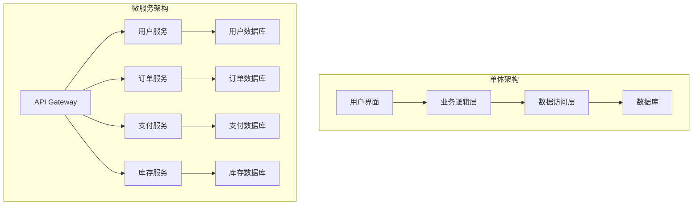

# 微服务架构设计与实践

微服务架构是一种将单一应用程序开发为一套小型服务的方法，每个服务运行在自己的进程中，并使用轻量级机制通信。

## 微服务架构概述

### 什么是微服务

微服务架构的核心特征：

- **服务独立性**：每个服务可以独立开发、部署和扩展
- **业务导向**：围绕业务能力组织服务
- **去中心化**：去中心化的治理和数据管理
- **故障隔离**：一个服务的故障不会影响整个系统
- **技术多样性**：不同服务可以使用不同的技术栈

### 微服务 vs 单体架构



## 微服务设计原则

### 1. 单一职责原则

每个微服务应该有明确的业务边界：

```javascript
// 用户服务 - 只处理用户相关操作
class UserService {
  async createUser(userData) {
    // 用户创建逻辑
  }
  
  async getUserById(userId) {
    // 获取用户信息
  }
  
  async updateUserProfile(userId, profileData) {
    // 更新用户资料
  }
  
  async deleteUser(userId) {
    // 删除用户
  }
}

// 订单服务 - 只处理订单相关操作
class OrderService {
  async createOrder(orderData) {
    // 创建订单逻辑
  }
  
  async getOrderById(orderId) {
    // 获取订单信息
  }
  
  async updateOrderStatus(orderId, status) {
    // 更新订单状态
  }
  
  async cancelOrder(orderId) {
    // 取消订单
  }
}
```

### 2. 数据库分离

每个微服务拥有自己的数据库：

```sql
-- 用户服务数据库
CREATE DATABASE user_service;
USE user_service;

CREATE TABLE users (
    id VARCHAR(36) PRIMARY KEY,
    email VARCHAR(255) UNIQUE NOT NULL,
    name VARCHAR(100) NOT NULL,
    created_at TIMESTAMP DEFAULT CURRENT_TIMESTAMP
);

-- 订单服务数据库
CREATE DATABASE order_service;
USE order_service;

CREATE TABLE orders (
    id VARCHAR(36) PRIMARY KEY,
    user_id VARCHAR(36) NOT NULL,
    total_amount DECIMAL(10,2) NOT NULL,
    status ENUM('pending', 'confirmed', 'shipped', 'delivered', 'cancelled'),
    created_at TIMESTAMP DEFAULT CURRENT_TIMESTAMP
);
```

### 3. API优先设计

定义清晰的服务接口：

```yaml
# user-service-api.yaml
openapi: 3.0.0
info:
  title: User Service API
  version: 1.0.0

paths:
  /users:
    post:
      summary: Create a new user
      requestBody:
        required: true
        content:
          application/json:
            schema:
              type: object
              properties:
                email:
                  type: string
                  format: email
                name:
                  type: string
              required:
                - email
                - name
      responses:
        '201':
          description: User created successfully
          content:
            application/json:
              schema:
                $ref: '#/components/schemas/User'
        '400':
          description: Invalid input
        '409':
          description: User already exists

  /users/{userId}:
    get:
      summary: Get user by ID
      parameters:
        - name: userId
          in: path
          required: true
          schema:
            type: string
      responses:
        '200':
          description: User found
          content:
            application/json:
              schema:
                $ref: '#/components/schemas/User'
        '404':
          description: User not found

components:
  schemas:
    User:
      type: object
      properties:
        id:
          type: string
        email:
          type: string
        name:
          type: string
        createdAt:
          type: string
          format: date-time
```

## 服务间通信

### 1. 同步通信 - REST API

```javascript
// 订单服务调用用户服务
class OrderService {
  constructor() {
    this.userServiceUrl = process.env.USER_SERVICE_URL
    this.httpClient = axios.create({
      timeout: 5000,
      headers: {
        'Content-Type': 'application/json'
      }
    })
  }
  
  async createOrder(orderData) {
    try {
      // 验证用户是否存在
      const userResponse = await this.httpClient.get(
        `${this.userServiceUrl}/users/${orderData.userId}`
      )
      
      if (!userResponse.data) {
        throw new Error('User not found')
      }
      
      // 创建订单
      const order = {
        id: generateId(),
        userId: orderData.userId,
        items: orderData.items,
        totalAmount: this.calculateTotal(orderData.items),
        status: 'pending',
        createdAt: new Date()
      }
      
      await this.orderRepository.save(order)
      return order
      
    } catch (error) {
      if (error.code === 'ECONNREFUSED') {
        throw new Error('User service unavailable')
      }
      throw error
    }
  }
}
```

### 2. 异步通信 - 消息队列

```javascript
// 使用RabbitMQ进行异步通信
const amqp = require('amqplib')

class EventPublisher {
  constructor() {
    this.connection = null
    this.channel = null
  }
  
  async connect() {
    this.connection = await amqp.connect(process.env.RABBITMQ_URL)
    this.channel = await this.connection.createChannel()
  }
  
  async publishEvent(exchange, routingKey, event) {
    await this.channel.assertExchange(exchange, 'topic', { durable: true })
    
    const message = {
      eventId: generateId(),
      eventType: event.type,
      timestamp: new Date().toISOString(),
      data: event.data
    }
    
    this.channel.publish(
      exchange,
      routingKey,
      Buffer.from(JSON.stringify(message)),
      { persistent: true }
    )
  }
}

// 订单服务发布事件
class OrderService {
  constructor() {
    this.eventPublisher = new EventPublisher()
  }
  
  async createOrder(orderData) {
    const order = await this.orderRepository.save(orderData)
    
    // 发布订单创建事件
    await this.eventPublisher.publishEvent(
      'orders',
      'order.created',
      {
        type: 'OrderCreated',
        data: {
          orderId: order.id,
          userId: order.userId,
          totalAmount: order.totalAmount,
          items: order.items
        }
      }
    )
    
    return order
  }
}

// 库存服务监听事件
class InventoryService {
  constructor() {
    this.eventSubscriber = new EventSubscriber()
  }
  
  async startListening() {
    await this.eventSubscriber.subscribe(
      'orders',
      'order.created',
      this.handleOrderCreated.bind(this)
    )
  }
  
  async handleOrderCreated(event) {
    const { orderId, items } = event.data
    
    try {
      // 减少库存
      for (const item of items) {
        await this.reduceInventory(item.productId, item.quantity)
      }
      
      // 发布库存更新事件
      await this.eventPublisher.publishEvent(
        'inventory',
        'inventory.updated',
        {
          type: 'InventoryUpdated',
          data: { orderId, items }
        }
      )
      
    } catch (error) {
      // 发布库存不足事件
      await this.eventPublisher.publishEvent(
        'inventory',
        'inventory.insufficient',
        {
          type: 'InventoryInsufficient',
          data: { orderId, error: error.message }
        }
      )
    }
  }
}
```

### 3. 服务发现

```javascript
// 使用Consul进行服务发现
const consul = require('consul')()

class ServiceRegistry {
  async registerService(serviceName, serviceId, host, port, healthCheckUrl) {
    const serviceDefinition = {
      id: serviceId,
      name: serviceName,
      address: host,
      port: port,
      check: {
        http: healthCheckUrl,
        interval: '10s',
        timeout: '5s'
      },
      tags: ['api', 'microservice']
    }
    
    await consul.agent.service.register(serviceDefinition)
    console.log(`Service ${serviceName} registered with ID ${serviceId}`)
  }
  
  async discoverService(serviceName) {
    const services = await consul.health.service({
      service: serviceName,
      passing: true
    })
    
    if (services.length === 0) {
      throw new Error(`No healthy instances of ${serviceName} found`)
    }
    
    // 简单的负载均衡 - 随机选择
    const randomIndex = Math.floor(Math.random() * services.length)
    const service = services[randomIndex].Service
    
    return {
      host: service.Address,
      port: service.Port
    }
  }
  
  async deregisterService(serviceId) {
    await consul.agent.service.deregister(serviceId)
    console.log(`Service ${serviceId} deregistered`)
  }
}

// 服务客户端
class ServiceClient {
  constructor(serviceName) {
    this.serviceName = serviceName
    this.serviceRegistry = new ServiceRegistry()
  }
  
  async makeRequest(path, options = {}) {
    const service = await this.serviceRegistry.discoverService(this.serviceName)
    const url = `http://${service.host}:${service.port}${path}`
    
    return axios({
      url,
      ...options,
      timeout: 5000
    })
  }
}
```

## API网关

### 网关功能实现

```javascript
// API Gateway实现
const express = require('express')
const httpProxy = require('http-proxy-middleware')
const rateLimit = require('express-rate-limit')
const jwt = require('jsonwebtoken')

class ApiGateway {
  constructor() {
    this.app = express()
    this.serviceRegistry = new ServiceRegistry()
    this.setupMiddleware()
    this.setupRoutes()
  }
  
  setupMiddleware() {
    // 速率限制
    const limiter = rateLimit({
      windowMs: 15 * 60 * 1000, // 15分钟
      max: 100 // 限制每个IP 100个请求
    })
    this.app.use(limiter)
    
    // 身份验证
    this.app.use('/api', this.authenticateToken.bind(this))
    
    // 请求日志
    this.app.use(this.logRequest.bind(this))
  }
  
  authenticateToken(req, res, next) {
    const authHeader = req.headers['authorization']
    const token = authHeader && authHeader.split(' ')[1]
    
    if (!token) {
      return res.status(401).json({ error: 'Access token required' })
    }
    
    jwt.verify(token, process.env.JWT_SECRET, (err, user) => {
      if (err) {
        return res.status(403).json({ error: 'Invalid token' })
      }
      req.user = user
      next()
    })
  }
  
  logRequest(req, res, next) {
    console.log(`${new Date().toISOString()} - ${req.method} ${req.url}`)
    next()
  }
  
  async setupRoutes() {
    // 用户服务路由
    this.app.use('/api/users', await this.createProxy('user-service'))
    
    // 订单服务路由
    this.app.use('/api/orders', await this.createProxy('order-service'))
    
    // 支付服务路由
    this.app.use('/api/payments', await this.createProxy('payment-service'))
    
    // 库存服务路由
    this.app.use('/api/inventory', await this.createProxy('inventory-service'))
  }
  
  async createProxy(serviceName) {
    return httpProxy({
      target: await this.getServiceUrl(serviceName),
      changeOrigin: true,
      pathRewrite: {
        [`^/api/${serviceName.replace('-service', 's')}`]: ''
      },
      onError: (err, req, res) => {
        console.error(`Proxy error for ${serviceName}:`, err.message)
        res.status(503).json({ error: 'Service unavailable' })
      },
      onProxyReq: (proxyReq, req, res) => {
        // 添加用户信息到请求头
        if (req.user) {
          proxyReq.setHeader('X-User-Id', req.user.id)
          proxyReq.setHeader('X-User-Role', req.user.role)
        }
      }
    })
  }
  
  async getServiceUrl(serviceName) {
    try {
      const service = await this.serviceRegistry.discoverService(serviceName)
      return `http://${service.host}:${service.port}`
    } catch (error) {
      console.error(`Failed to discover ${serviceName}:`, error.message)
      throw error
    }
  }
  
  start(port = 3000) {
    this.app.listen(port, () => {
      console.log(`API Gateway running on port ${port}`)
    })
  }
}

// 启动网关
const gateway = new ApiGateway()
gateway.start()
```

## 数据一致性

### Saga模式实现

```javascript
// Saga协调器
class SagaOrchestrator {
  constructor() {
    this.eventPublisher = new EventPublisher()
    this.sagaRepository = new SagaRepository()
  }
  
  async executeOrderSaga(orderData) {
    const sagaId = generateId()
    const saga = {
      id: sagaId,
      type: 'CreateOrder',
      status: 'started',
      steps: [
        { name: 'validateUser', status: 'pending' },
        { name: 'reserveInventory', status: 'pending' },
        { name: 'processPayment', status: 'pending' },
        { name: 'createOrder', status: 'pending' }
      ],
      data: orderData,
      createdAt: new Date()
    }
    
    await this.sagaRepository.save(saga)
    
    // 开始第一步
    await this.executeStep(sagaId, 'validateUser')
    
    return sagaId
  }
  
  async executeStep(sagaId, stepName) {
    const saga = await this.sagaRepository.findById(sagaId)
    const step = saga.steps.find(s => s.name === stepName)
    
    if (!step || step.status !== 'pending') {
      return
    }
    
    step.status = 'executing'
    await this.sagaRepository.update(saga)
    
    try {
      switch (stepName) {
        case 'validateUser':
          await this.validateUser(saga)
          break
        case 'reserveInventory':
          await this.reserveInventory(saga)
          break
        case 'processPayment':
          await this.processPayment(saga)
          break
        case 'createOrder':
          await this.createOrder(saga)
          break
      }
    } catch (error) {
      await this.handleStepFailure(sagaId, stepName, error)
    }
  }
  
  async validateUser(saga) {
    await this.eventPublisher.publishEvent(
      'user-validation',
      'user.validate',
      {
        type: 'ValidateUser',
        sagaId: saga.id,
        data: { userId: saga.data.userId }
      }
    )
  }
  
  async handleStepSuccess(sagaId, stepName) {
    const saga = await this.sagaRepository.findById(sagaId)
    const step = saga.steps.find(s => s.name === stepName)
    step.status = 'completed'
    
    // 执行下一步
    const nextStep = this.getNextStep(saga, stepName)
    if (nextStep) {
      await this.executeStep(sagaId, nextStep.name)
    } else {
      // Saga完成
      saga.status = 'completed'
      await this.sagaRepository.update(saga)
    }
  }
  
  async handleStepFailure(sagaId, stepName, error) {
    const saga = await this.sagaRepository.findById(sagaId)
    const step = saga.steps.find(s => s.name === stepName)
    step.status = 'failed'
    step.error = error.message
    
    saga.status = 'compensating'
    await this.sagaRepository.update(saga)
    
    // 开始补偿
    await this.startCompensation(saga)
  }
  
  async startCompensation(saga) {
    const completedSteps = saga.steps
      .filter(s => s.status === 'completed')
      .reverse() // 逆序补偿
    
    for (const step of completedSteps) {
      await this.compensateStep(saga.id, step.name)
    }
    
    saga.status = 'compensated'
    await this.sagaRepository.update(saga)
  }
}
```

### 事件溯源

```javascript
// 事件存储
class EventStore {
  constructor() {
    this.events = new Map() // 实际应该使用数据库
  }
  
  async saveEvent(streamId, event) {
    if (!this.events.has(streamId)) {
      this.events.set(streamId, [])
    }
    
    const eventWithMetadata = {
      ...event,
      eventId: generateId(),
      streamId,
      version: this.events.get(streamId).length + 1,
      timestamp: new Date().toISOString()
    }
    
    this.events.get(streamId).push(eventWithMetadata)
    return eventWithMetadata
  }
  
  async getEvents(streamId, fromVersion = 0) {
    const events = this.events.get(streamId) || []
    return events.filter(e => e.version > fromVersion)
  }
  
  async getAllEvents() {
    const allEvents = []
    for (const events of this.events.values()) {
      allEvents.push(...events)
    }
    return allEvents.sort((a, b) => new Date(a.timestamp) - new Date(b.timestamp))
  }
}

// 聚合根
class OrderAggregate {
  constructor() {
    this.id = null
    this.userId = null
    this.items = []
    this.status = null
    this.totalAmount = 0
    this.version = 0
    this.uncommittedEvents = []
  }
  
  static fromHistory(events) {
    const order = new OrderAggregate()
    events.forEach(event => order.apply(event))
    return order
  }
  
  createOrder(orderId, userId, items) {
    if (this.id) {
      throw new Error('Order already exists')
    }
    
    const event = {
      type: 'OrderCreated',
      data: {
        orderId,
        userId,
        items,
        totalAmount: this.calculateTotal(items)
      }
    }
    
    this.raiseEvent(event)
  }
  
  confirmOrder() {
    if (this.status !== 'pending') {
      throw new Error('Order cannot be confirmed')
    }
    
    this.raiseEvent({
      type: 'OrderConfirmed',
      data: { orderId: this.id }
    })
  }
  
  cancelOrder(reason) {
    if (this.status === 'delivered') {
      throw new Error('Delivered order cannot be cancelled')
    }
    
    this.raiseEvent({
      type: 'OrderCancelled',
      data: { orderId: this.id, reason }
    })
  }
  
  raiseEvent(event) {
    this.apply(event)
    this.uncommittedEvents.push(event)
  }
  
  apply(event) {
    switch (event.type) {
      case 'OrderCreated':
        this.id = event.data.orderId
        this.userId = event.data.userId
        this.items = event.data.items
        this.totalAmount = event.data.totalAmount
        this.status = 'pending'
        break
        
      case 'OrderConfirmed':
        this.status = 'confirmed'
        break
        
      case 'OrderCancelled':
        this.status = 'cancelled'
        break
    }
    
    this.version++
  }
  
  getUncommittedEvents() {
    return this.uncommittedEvents
  }
  
  markEventsAsCommitted() {
    this.uncommittedEvents = []
  }
  
  calculateTotal(items) {
    return items.reduce((total, item) => total + (item.price * item.quantity), 0)
  }
}
```

## 监控和可观测性

### 分布式追踪

```javascript
const opentelemetry = require('@opentelemetry/api')
const { NodeSDK } = require('@opentelemetry/auto-instrumentations-node')
const { JaegerExporter } = require('@opentelemetry/exporter-jaeger')

// 初始化追踪
const jaegerExporter = new JaegerExporter({
  endpoint: 'http://localhost:14268/api/traces'
})

const sdk = new NodeSDK({
  traceExporter: jaegerExporter,
  serviceName: 'order-service'
})

sdk.start()

// 在服务中使用追踪
class OrderService {
  async createOrder(orderData) {
    const tracer = opentelemetry.trace.getTracer('order-service')
    
    return tracer.startActiveSpan('create-order', async (span) => {
      try {
        span.setAttributes({
          'order.userId': orderData.userId,
          'order.itemCount': orderData.items.length,
          'order.totalAmount': orderData.totalAmount
        })
        
        // 验证用户
        await tracer.startActiveSpan('validate-user', async (userSpan) => {
          const user = await this.userService.getUser(orderData.userId)
          userSpan.setAttributes({ 'user.id': user.id, 'user.email': user.email })
          userSpan.end()
          return user
        })
        
        // 检查库存
        await tracer.startActiveSpan('check-inventory', async (inventorySpan) => {
          for (const item of orderData.items) {
            await this.inventoryService.checkAvailability(item.productId, item.quantity)
          }
          inventorySpan.end()
        })
        
        // 创建订单
        const order = await this.orderRepository.save(orderData)
        
        span.setStatus({ code: opentelemetry.SpanStatusCode.OK })
        span.end()
        
        return order
        
      } catch (error) {
        span.recordException(error)
        span.setStatus({
          code: opentelemetry.SpanStatusCode.ERROR,
          message: error.message
        })
        span.end()
        throw error
      }
    })
  }
}
```

### 健康检查

```javascript
// 健康检查实现
class HealthChecker {
  constructor() {
    this.checks = new Map()
  }
  
  addCheck(name, checkFunction) {
    this.checks.set(name, checkFunction)
  }
  
  async runChecks() {
    const results = {
      status: 'healthy',
      timestamp: new Date().toISOString(),
      checks: {}
    }
    
    for (const [name, checkFn] of this.checks) {
      try {
        const startTime = Date.now()
        await checkFn()
        const duration = Date.now() - startTime
        
        results.checks[name] = {
          status: 'healthy',
          duration: `${duration}ms`
        }
      } catch (error) {
        results.checks[name] = {
          status: 'unhealthy',
          error: error.message
        }
        results.status = 'unhealthy'
      }
    }
    
    return results
  }
}

// 在Express应用中使用
const healthChecker = new HealthChecker()

// 添加数据库检查
healthChecker.addCheck('database', async () => {
  await mongoose.connection.db.admin().ping()
})

// 添加外部服务检查
healthChecker.addCheck('user-service', async () => {
  const response = await axios.get(`${userServiceUrl}/health`, { timeout: 5000 })
  if (response.status !== 200) {
    throw new Error('User service unhealthy')
  }
})

// 添加消息队列检查
healthChecker.addCheck('message-queue', async () => {
  // 检查RabbitMQ连接
  if (!rabbitConnection || rabbitConnection.connection.stream.destroyed) {
    throw new Error('Message queue connection lost')
  }
})

// 健康检查端点
app.get('/health', async (req, res) => {
  const health = await healthChecker.runChecks()
  const statusCode = health.status === 'healthy' ? 200 : 503
  res.status(statusCode).json(health)
})
```

## 部署和DevOps

### Docker容器化

```dockerfile
# Dockerfile for Node.js microservice
FROM node:18-alpine

# 创建应用目录
WORKDIR /usr/src/app

# 复制package文件
COPY package*.json ./

# 安装依赖
RUN npm ci --only=production

# 复制应用代码
COPY . .

# 创建非root用户
RUN addgroup -g 1001 -S nodejs
RUN adduser -S nextjs -u 1001

# 更改文件所有权
USER nodejs

# 暴露端口
EXPOSE 3000

# 健康检查
HEALTHCHECK --interval=30s --timeout=3s --start-period=5s --retries=3 \
  CMD curl -f http://localhost:3000/health || exit 1

# 启动应用
CMD ["node", "server.js"]
```

### Kubernetes部署

```yaml
# order-service-deployment.yaml
apiVersion: apps/v1
kind: Deployment
metadata:
  name: order-service
  labels:
    app: order-service
spec:
  replicas: 3
  selector:
    matchLabels:
      app: order-service
  template:
    metadata:
      labels:
        app: order-service
    spec:
      containers:
      - name: order-service
        image: myregistry/order-service:latest
        ports:
        - containerPort: 3000
        env:
        - name: NODE_ENV
          value: "production"
        - name: DATABASE_URL
          valueFrom:
            secretKeyRef:
              name: order-service-secrets
              key: database-url
        - name: JWT_SECRET
          valueFrom:
            secretKeyRef:
              name: order-service-secrets
              key: jwt-secret
        resources:
          requests:
            memory: "128Mi"
            cpu: "100m"
          limits:
            memory: "256Mi"
            cpu: "200m"
        livenessProbe:
          httpGet:
            path: /health
            port: 3000
          initialDelaySeconds: 30
          periodSeconds: 10
        readinessProbe:
          httpGet:
            path: /health
            port: 3000
          initialDelaySeconds: 5
          periodSeconds: 5
---
apiVersion: v1
kind: Service
metadata:
  name: order-service
spec:
  selector:
    app: order-service
  ports:
    - protocol: TCP
      port: 80
      targetPort: 3000
  type: ClusterIP
```

## 最佳实践

### 1. 服务边界设计

```javascript
// 基于业务能力划分服务
const serviceBoundaries = {
  // 用户管理域
  userService: {
    responsibilities: [
      '用户注册和认证',
      '用户资料管理',
      '权限管理'
    ],
    data: ['users', 'roles', 'permissions']
  },
  
  // 订单管理域
  orderService: {
    responsibilities: [
      '订单创建和管理',
      '订单状态跟踪',
      '订单历史'
    ],
    data: ['orders', 'order_items']
  },
  
  // 库存管理域
  inventoryService: {
    responsibilities: [
      '库存跟踪',
      '库存预留',
      '库存补充'
    ],
    data: ['products', 'inventory', 'reservations']
  }
}
```

### 2. 错误处理策略

```javascript
// 断路器模式
class CircuitBreaker {
  constructor(threshold = 5, timeout = 60000) {
    this.threshold = threshold
    this.timeout = timeout
    this.failureCount = 0
    this.lastFailureTime = null
    this.state = 'CLOSED' // CLOSED, OPEN, HALF_OPEN
  }
  
  async call(fn) {
    if (this.state === 'OPEN') {
      if (Date.now() - this.lastFailureTime > this.timeout) {
        this.state = 'HALF_OPEN'
      } else {
        throw new Error('Circuit breaker is OPEN')
      }
    }
    
    try {
      const result = await fn()
      this.onSuccess()
      return result
    } catch (error) {
      this.onFailure()
      throw error
    }
  }
  
  onSuccess() {
    this.failureCount = 0
    this.state = 'CLOSED'
  }
  
  onFailure() {
    this.failureCount++
    this.lastFailureTime = Date.now()
    
    if (this.failureCount >= this.threshold) {
      this.state = 'OPEN'
    }
  }
}

// 重试机制
class RetryPolicy {
  static async withRetry(fn, maxRetries = 3, delay = 1000) {
    let lastError
    
    for (let i = 0; i <= maxRetries; i++) {
      try {
        return await fn()
      } catch (error) {
        lastError = error
        
        if (i === maxRetries) {
          break
        }
        
        // 指数退避
        const waitTime = delay * Math.pow(2, i)
        await new Promise(resolve => setTimeout(resolve, waitTime))
      }
    }
    
    throw lastError
  }
}
```

### 3. 配置管理

```javascript
// 配置中心客户端
class ConfigClient {
  constructor(configServiceUrl) {
    this.configServiceUrl = configServiceUrl
    this.cache = new Map()
    this.refreshInterval = 30000 // 30秒
    this.startPeriodicRefresh()
  }
  
  async getConfig(key, defaultValue = null) {
    if (this.cache.has(key)) {
      return this.cache.get(key)
    }
    
    try {
      const response = await axios.get(`${this.configServiceUrl}/config/${key}`)
      const value = response.data.value
      this.cache.set(key, value)
      return value
    } catch (error) {
      console.warn(`Failed to fetch config ${key}:`, error.message)
      return defaultValue
    }
  }
  
  async refreshConfig() {
    try {
      const response = await axios.get(`${this.configServiceUrl}/config`)
      const configs = response.data
      
      for (const [key, value] of Object.entries(configs)) {
        this.cache.set(key, value)
      }
    } catch (error) {
      console.error('Failed to refresh config:', error.message)
    }
  }
  
  startPeriodicRefresh() {
    setInterval(() => {
      this.refreshConfig()
    }, this.refreshInterval)
  }
}
```

## 总结

微服务架构提供了构建大规模分布式系统的强大方法：

### 优势
- **独立部署**：服务可以独立开发和部署
- **技术多样性**：不同服务可以使用不同技术栈
- **故障隔离**：单个服务故障不会影响整个系统
- **团队自治**：小团队可以独立负责特定服务

### 挑战
- **分布式复杂性**：网络延迟、故障处理、数据一致性
- **运维复杂度**：需要更复杂的监控和部署流程
- **数据管理**：跨服务的数据一致性和事务处理
- **测试复杂性**：集成测试和端到端测试更加困难

### 关键成功因素
1. **合理的服务边界**：基于业务能力而非技术层面划分
2. **强大的DevOps能力**：自动化部署、监控和运维
3. **完善的可观测性**：日志、指标、追踪
4. **渐进式迁移**：从单体架构逐步演进到微服务

微服务架构不是银弹，需要根据团队能力、业务复杂度和技术要求来决定是否采用。